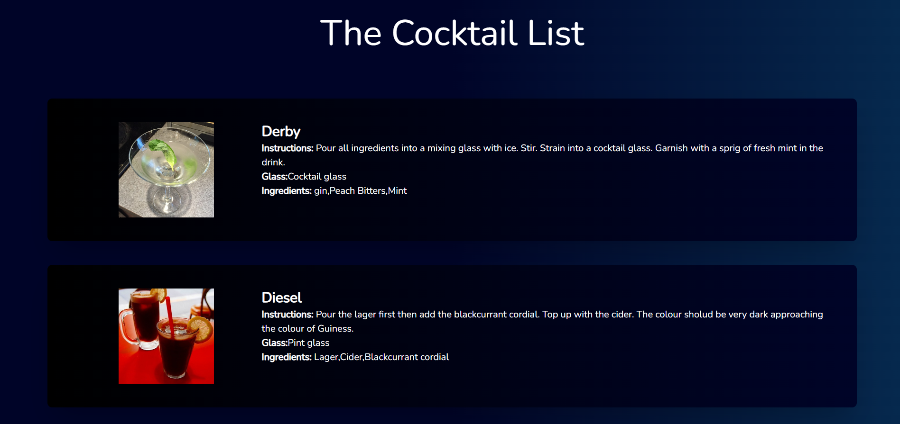

<a name="readme-top"></a>
<div align="center">

    <h1>Brewdog API Demo</h1>

    <p>
        Brewdog API consumption demo is made using Vue and Nuxt JS .
    </p>
   
</div>

<br />

<!-- Table of Contents -->
<details>

<summary>

# :notebook_with_decorative_cover: Table of Contents

</summary>

- [:notebook\_with\_decorative\_cover: Table of Contents](#notebook_with_decorative_cover-table-of-contents)
  - [:star2: About the Project](#star2-about-the-project)
    - [:bangbang: Folder Structure](#bangbang-folder-structure)
    - [:space\_invader: Tech Stack](#space_invader-tech-stack)
  - [:toolbox: Getting Started](#toolbox-getting-started)
    - [:gear: Installation](#gear-installation)
      - [Step 1:](#step-1)
      - [Step 2:](#step-2)
      - [Step 3:](#step-3)
      - [Step 4:](#step-4)
      - [Step 5:](#step-5)
    - [:running: Run Locally](#running-run-locally)
      - [Step 1:](#step-1-1)
      - [Step 2:](#step-2-1)

</details>  

<!-- About the Project -->
## :star2: About the Project

<div align="center">
  
</div>

<br />

Brewdog API consumption demo is made using Vue and Nuxt JS. ⏭

<!-- Folder Structure -->
### :bangbang: Folder Structure

Here is the folder structure of this website.
```bash
brewdog-api-demo/
|- assets/
  |-- main.css
|- pages/
  |-- index.vue
|- public/
    |-- favicon.ico
|- readme_assets
    |-- website.png
|- server/
    |-- tsconfig.json
|- .gitattributes
|- .gitignore
|- .npmrc
|- app.vue
|- nuxt.config.ts
|- package-lock.json
|- package.json
|- README.md
|- tsconfig.json
|- yarn.lock
```
<br />

<!-- TechStack -->
### :space_invader: Tech Stack

[](https://skillicons.dev)

<p align="right">(<a href="#readme-top">back to top</a>)</p>

<!-- Getting Started -->
## :toolbox: Getting Started

<!-- Installation -->
### :gear: Installation

#### Step 1:
Download or clone this repo by using the link below:

```bash
 https://github.com/saumya11mehta/brewdog-api-demo
```

#### Step 2:

Make sure that Node.js is installed by execute the following command in console:

```bash
  node -v
```

#### Step 3:

At the main folder execute the following command in console to get the required dependencies:

```bash
  npm install
```

#### Step 4:

At the main folder execute the following command in console to creates a build directory with a production build of Brewdog API Demo:

```bash
  npm run build
```

#### Step 5:

At the main folder execute the following command in console to run the server:

```bash
  npm run start
```

<!-- Run Locally -->
### :running: Run Locally

#### Step 1:

At the main folder execute the following command in console to get the required dependencies:

```bash
  npm install
```

#### Step 2:

At the main folder execute the following command in console to run the development server:

```bash
  npm run dev
```

<p align="right">(<a href="#readme-top">back to top</a>)</p>
